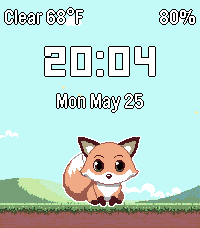
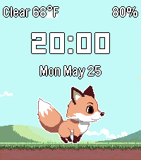
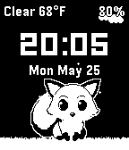
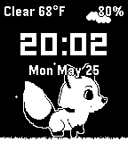

# Fox Weather

**A Pebble watchface where the sky follows your weather and a pixel fox keeps you company.**

The background changes with the current conditions, a fox sits (or walks) on the ground, and the
time, date, battery, and temperature sit on top. Adapted from the
[Pebble Adventure](https://github.com/levonn-dev/pebble-adventure) game.

Runs on **Pebble Time 2 (emery, color)** and **Pebble 2 Duo (flint, B&W)**.

---

## Features

- **Weather-driven background.** Live conditions (via Open-Meteo) pick the scene:

  | Condition (WMO) | Scene | Effect |
  |---|---|---|
  | Clear / mainly clear | Plains ☀️ | drifting clouds |
  | Cloudy / overcast / fog | Forest | falling leaves |
  | Drizzle / rain / showers | Storm | rain streaks |
  | Thunderstorm | Storm | rain **+ lightning** |
  | Snow | Mountain | snowflakes |

- **Idle or walking fox** - choose in settings; both are 4-frame sprites.
- **Brief-burst animation** - the fox and weather particles animate for ~4 s after each minute
  change and on a wrist-shake, then freeze. No continuous redraw, so it's easy on the battery.
- **At a glance:** big time, date, battery %, and `Condition + temperature`.
- **Configurable** temperature unit (°F / °C) and fox mode, via an in-app settings page.
- **Dual platform:** full color on emery, crisp black-and-white on flint.

---

## Screenshots

Both platforms, with the **Idle** and **Walking** fox (here on the Clear scene - the background
changes with the weather):

<table>
  <tr><th></th><th>Idle fox</th><th>Walking fox</th></tr>
  <tr>
    <td align="right"><b>Emery</b><br><sub>color, 200×228</sub></td>
    <td></td>
    <td></td>
  </tr>
  <tr>
    <td align="right"><b>Flint</b><br><sub>B&amp;W, 144×168</sub></td>
    <td></td>
    <td></td>
  </tr>
</table>

---

## How it works

- **Weather** is fetched on the phone by PebbleKit JS (`src/pkjs/index.js`) from the free
  [Open-Meteo API](https://open-meteo.com/) (no API key) and sent to the watch over AppMessage.
  Temperature is fetched in Celsius and **converted on the watch**, so switching °F/°C updates
  instantly without a network round-trip. Weather refreshes on launch and every 30 minutes.
- **Settings** use [Clay](https://github.com/pebble-dev/clay) (`@rebble/clay`); the chosen values
  are sent to the watch and persisted there.
- The watch redraws on `MINUTE_UNIT` ticks and animates only in short bursts, per Pebble
  battery-efficiency guidance.

---

## Build & run

**Prerequisites:** [Pebble SDK](https://developer.repebble.com/sdk/) (with the QEMU emulator) and
Node.js.

```bash
npm install            # fetches @rebble/clay for the config page
pebble build           # builds emery + flint -> build/pebble-adventure-wf.pbw
```

Install on the emulator:

```bash
pebble install --emulator emery    # color
pebble install --emulator flint    # B&W
```

Or on a paired watch: `pebble install --phone`. Stream logs with `pebble logs`.

> **Note:** after changing `messageKeys` in `package.json`, run `pebble clean && pebble build` -
> incremental builds don't always regenerate the message-key header.

---

## Configuration

Open the watchface's settings (the gear in the Pebble phone app):

- **Temperature unit** - Fahrenheit or Celsius.
- **Fox** - Idle or Walking.

Changes apply immediately on save.

---

## Project structure

```
src/c/
  main.c                  window/layers, draw, tick, brief-burst timer, AppMessage, persistence
  weather.{h,c}           WMO weather_code -> scene / lightning / label  (host-tested)
  backgrounds.{h,c}       lazy-loaded scene bitmap, bottom-aligned draw, per-scene ground line
  backgrounds_effects.c   procedural overlays (clouds / leaves / rain+lightning / snow)
  sprites.{h,c}           mode-aware fox loader (idle or walk, one set resident)
src/pkjs/
  index.js                Open-Meteo fetch + Clay config + AppMessage
  config.json             Clay settings (temperature unit, fox mode)
test/test_weather.c       host unit test for the weather mapping
resources/images/         backgrounds (color + B&W) and fox sprites
docs/superpowers/         design spec and implementation plan
CMakeLists.txt            CLion indexing only (the real build is `pebble build`)
```

---

## Debug

`src/c/main.c` has a compile-time switch to exercise scenes without live weather (ships off):

- `WF_DEBUG 1` + `WF_DEBUG_FORCE_CODE` set to a WMO code (`0` clear, `3` cloudy, `61` rain,
  `95` thunder, `71` snow) pins that scene.
- `WF_DEBUG 1` + `WF_DEBUG_FORCE_CODE -1` cycles the scenes on each wrist-shake.

Leave `WF_DEBUG 0` for release builds.

---

## Credits

- Backgrounds, fox sprites, and weather-effect code adapted from **Pebble Adventure**.
- Weather data from **[Open-Meteo](https://open-meteo.com/)**.
- Settings via **[Clay](https://github.com/pebble-dev/clay)**.
